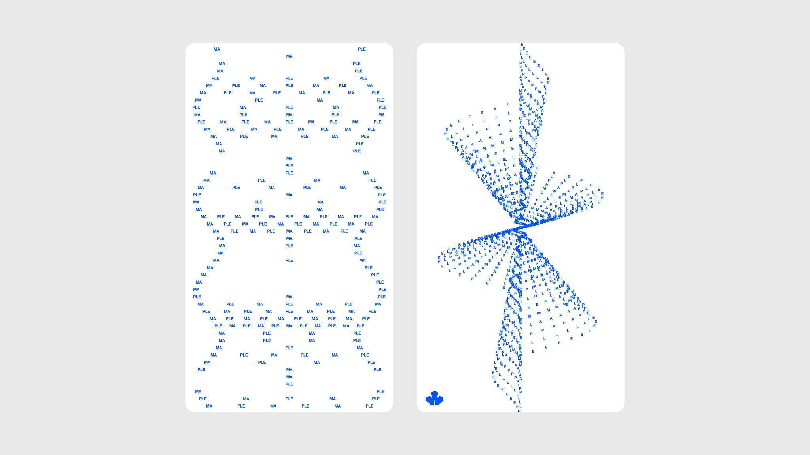

I remember when I was a kid, my fathers bought two drawings made with a typewriter, a fall and a horse, I really like it this type of art. But that was stuck on my memories. But more recently, I was scrolling on the [v.tulv.in](v.tulv.in) gallery, and I found this beatiful image:



And my curiosiry woke up. So here you are, reading how I build a image to ascii parser from scratch. In add I was looking for an excuse to code in C again and performing a lot of computation was the perfect excuse to make it. So lets go!

# Setup the ground

[meson](https://mesonbuild.com/) is a compiler with too many porpuses, I used it to build and app with GTK4 and it was extremly fast. For this reason I build my project with it. Is too easy to use and I really thanks that beacuse C is very complex to understand. My configuration goes something like this:

```
project(
  'ascii-parser',
  'c',
  version: '0.1',
  license: 'GPL-3.0-or-later',
  default_options: [
    'warning_level=2',
    'werror=false',
    'c_std=gnu11',
  ],
)

# Directorios
src_dir = 'src'
data_dir = 'data'
include_dir = include_directories('include')

# Dependencias
gtk4 = dependency('gtk4')
gnome = import('gnome')
m = meson.get_compiler('c').find_library('m', required: false)

# Fuentes
sources = run_command(
  'find', src_dir, '-name', '*.c',
  check: true
).stdout().strip().split('\n')

# Archivos Blueprint
blueprint_files = run_command(
  'find', 'data/ui', '-name', '*.blp',
  check: true
).stdout().strip().split('\n')

blueprints = custom_target('blueprints',
  input: files(blueprint_files),
  output: '.',
  command: [
    find_program('blueprint-compiler'),
    'batch-compile',
    '@OUTPUT@',
    '@CURRENT_SOURCE_DIR@',
    '@INPUT@'
  ],
)

# Recursos
resources_xml = files(data_dir / 'resources.gresource.xml')
resources = gnome.compile_resources(
  'resources',
  resources_xml,
  dependencies: blueprints,
  source_dir: data_dir,
  c_name: 'resources'
)

# Binario principal
executable(
  'ascii-parser',
  sources,
  resources,
  include_directories: include_dir,
  dependencies: [gtk4, m],
  install: true,
  install_dir: get_option('bindir')
)
```
