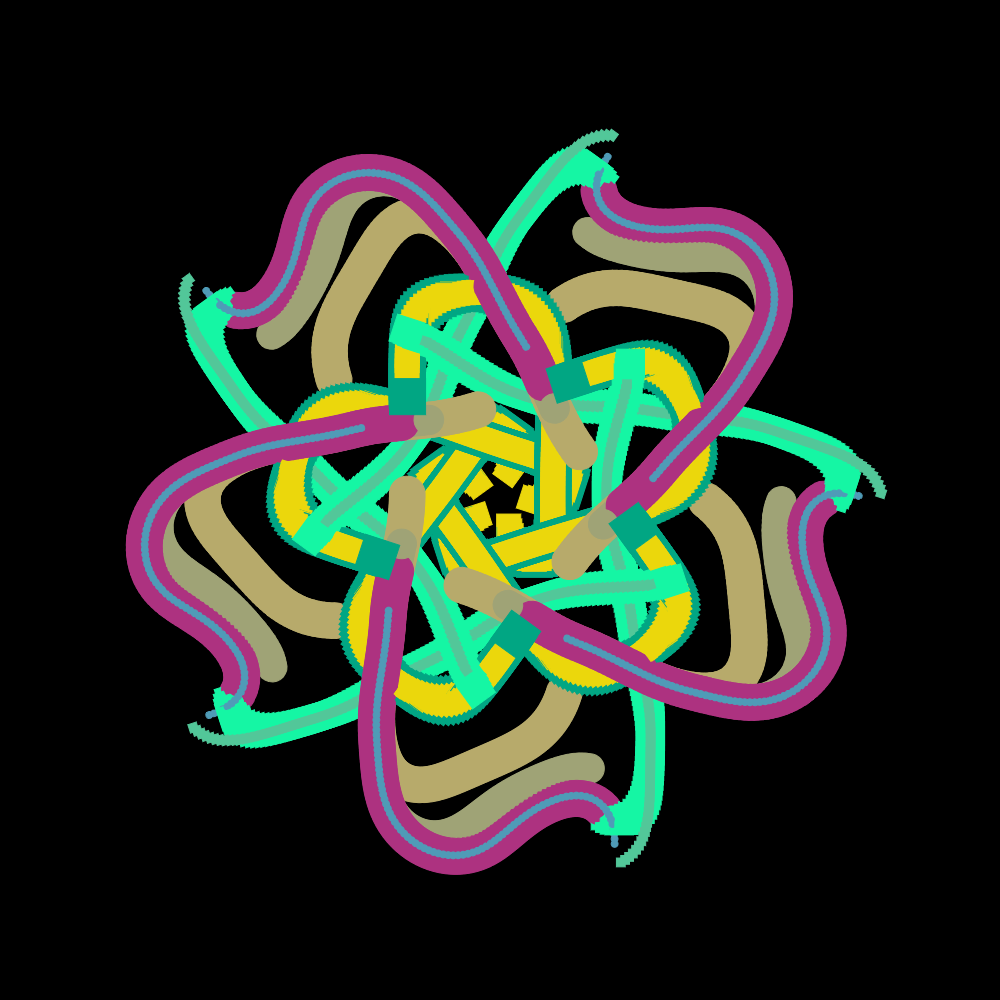
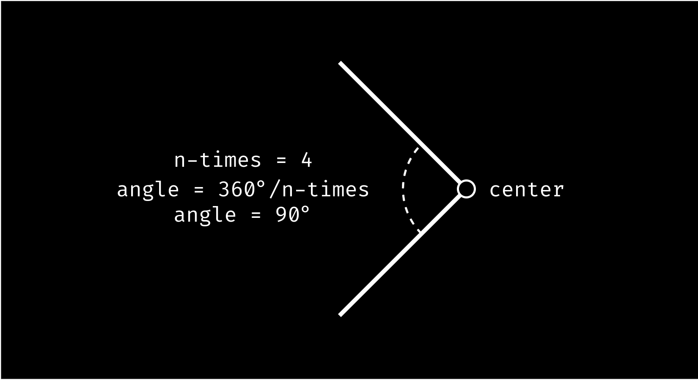

I recently stumbled upon the captivating work of [Atul Vinayak](https://a.tulv.in/), a programmer who maintained a blog from 2012 to 2022. A few months ago, I delved into one of his fascinating topics: **Algorithmic Art**. Today, I'm excited to share my journey of success in generating exquisite flowers using [p5.js](https://p5js.org/).



## Understanding Symmetric Patterns

Before we dive into the code, let's grasp the concept of symmetric patterns. These patterns consist of lines and curves radiating from a center, forming a symmetrical design based on a rotation angle.



To introduce an element of randomness, I experimented with parameters such as the number of lines per area, the rotation angle (n-times), and a variable called "curves" to add intricacy to the patterns.

```javascript
n_lines = floor(random(3, 10));
symmetric = floor(random(3, 10));
curves = floor(random(1, 10));
```

## Styling the Brushes

To enhance the diversity of the generated patterns, I utilized arrays to store the style information for each line. This allowed me to draw each line with a distinct style.

```javascript
colors = Array(n_lines);
strokes = Array(n_lines);
```

## Generating Random Points

Next, I created an array to store random points on the canvas. These points serve as the foundation for generating subsequent points and, consequently, lines or curves.

```javascript
points = [];

for (i = 0; i < n_lines; i++) {
  points[i] = Array(2);
  points[i][0] = random(w / 8);
  points[i][1] = 3 * points[i][0];
  strokes[i] = random(1, w / 10);
  colors[i] = [random(255), random(255), random(255)];
}
```

## The p5.js Sketch

Now, let's explore the p5.js sketch that brings these ideas to life. The canvas is initialized, and various parameters, such as the number of lines, symmetry, and curves, are randomized.

```javascript
w = 200;
points = [];
iter = 0;

function setup() {
  // Canvas setup
  createCanvas(w, w);
  background('#000');
  rectMode(CENTER);
  randomSeed();

  // Randomize parameters
  n_lines = floor(random(3, 10));
  symmetric = floor(random(3, 10));
  curves = floor(random(1, 10));

  // Initialize arrays for styles
  colors = Array(n_lines);
  strokes = Array(n_lines);

  // Generate random points and styles
  for (i = 0; i < n_lines; i++) {
    points[i] = Array(2);
    points[i][0] = random(w / 8);
    points[i][1] = 3 * points[i][0];
    strokes[i] = random(1, w / 10);
    colors[i] = [random(255), random(255), random(255)];
  }
}

function draw() {
  // Translate to the center of the canvas
  translate(width / 2, height / 2);

  // Draw symmetric patterns
  if (iter < n_lines * 250) {
    for (i = 0; i < n_lines; i++) {
      for (k = 0; k < symmetric; k++) {
        push();
        rotate(TAU * k / symmetric);

        // Set stroke and fill based on color array
        stroke(colors[i][0], colors[i][1], colors[i][2]);
        fill(colors[i][0], colors[i][1], colors[i][2]);

        // Apply noise for randomness
        n = noise(points[i][0] / w, points[i][1] / w);

        // Generate lines or curves based on conditions
        if (i % 2 == 0) {
          circle(points[i][0], points[i][1], strokes[i]);
          // Update points and strokes
          points[i][0] -= sin(n * n * TAU + curves);
          points[i][1] += cos(n * n * TAU + curves);
          strokes[i] -= log(symmetric, n) * cos(n * TAU) / curves;
        } else {
          rect(points[i][0], points[i][1], strokes[i]);
          // Update points and strokes
          points[i][0] += cos(n * TAU + curves);
          points[i][1] -= sin(n * TAU + curves);
          strokes[i] -= log(symmetric, n) * cos(n * TAU) / curves;
        }

        pop();
        iter++;
      }
    }
  }
}
```

Feel free to explore and modify this code to create your own mesmerizing algorithmic art with p5.js!

# NOTES 

## Variables:

1. **`w`**: Represents the width and height of the canvas. The canvas is a square with dimensions `w x w`.

2. **`points`**: An array used to store random points on the canvas. Each point is represented as an array `[x, y]`.

3. **`iter`**: An iteration variable used to control the loop in the `draw` function. It helps limit the number of iterations to avoid an infinite loop.

4. **`n_lines`**: Number of lines in the symmetric pattern. It is randomly generated between 3 and 10.

5. **`symmetric`**: Controls the number of symmetric repetitions around the center. Randomly generated between 3 and 10.

6. **`curves`**: A variable used to add complexity to the patterns. Randomly generated between 1 and 10.

7. **`colors`**: An array to store the RGB color values for each line.

8. **`strokes`**: An array to store the stroke values for each line.

## Functions:
### `setup()` Function:

- **`createCanvas(w, w)`**: Initializes the canvas with a square shape of dimensions `w x w`.
  
- **`background('#000')`**: Sets the background color of the canvas to black.

- **`rectMode(CENTER)`**: Sets the mode for drawing rectangles to the center.

- **`randomSeed()`**: Initializes the random seed for consistent randomness.

- **Random Initialization**:
  ```javascript
  n_lines = floor(random(3, 10));
  symmetric = floor(random(3, 10));
  curves = floor(random(1, 10));
  ```
  Randomly initializes the parameters for the number of lines, symmetry, and complexity of the patterns.

- **Array Initialization**:
  ```javascript
  for (i = 0; i < n_lines; i++) {
    // ...
  }
  ```
  Initializes arrays (`points`, `colors`, and `strokes`) for each line with random values.

#### `draw()` Function:

- **`translate(width / 2, height / 2)`**: Translates the origin to the center of the canvas.

- **Loop for Drawing Symmetric Patterns**:
  ```javascript
  if (iter < n_lines * 250) {
    for (i = 0; i < n_lines; i++) {
      for (k = 0; k < symmetric; k++) {
        // ...
      }
    }
  }
  ```
  Controls the drawing of symmetric patterns based on the iteration count.

- **Drawing Shapes and Updating Points**:
  ```javascript
  if (i % 2 == 0) {
    // Circle
  } else {
    // Rectangle
  }
  ```
  Draws either a circle or a rectangle based on whether the line index is even or odd. Updates the points and stroke values for the next iteration.

- **`pop()`**: Restores the previous drawing state.

- **Incrementing `iter`**: Ensures the loop does not run indefinitely.

# EXAMPLES

Please check **[this](https://drive.google.com/drive/folders/1g-Hoambx4gkxJVzEmgsa57BcnVqjIujm?usp=drive_link)**, there's a lot of beautiful examples.

Or generate your own flowers, have fun!
<iframe src="https://editor.p5js.org/renatosanz/full/BtH7JzXHV" height=400 width=330></iframe> 