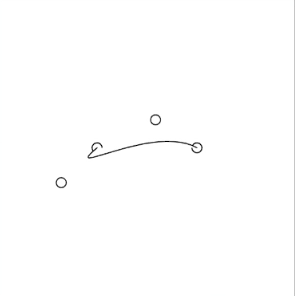

Curves are ubiquitous in real-world scenarios, from everyday life to digital landscapes. But have you ever wondered about the mechanics behind curve generation?

In my recent exploration of crafting curves using the p5.js editor, I discovered three effective approaches.

The first method involves using arcs, the simplest curves defined as segments of an ellipse. However, I found this method somewhat monotonous and may reserve it for future projects.

The second method employs continuous spline curves, requiring a set of points along the curve's trajectory. Yet, I explored alternative methods in search of optimal curve crafting.

Ultimately, Bezier curves emerged as the best choice for my project. These curves are generated through eight parameters, shaping the curve with four coordinates for both start and end points and four for control points.

## Initial Steps

To practice Bezier curve generation, I created a prototype animation engine. The animation involved rotating control points around the start and end points of the curve with a radius `n` and starting angle `k`. Here's what I achieved:

1. Define the start and end points, control points, animation speed, and rotation radius for the control points.
   ```js
   point1X = 100;
   point1Y = 150;

   point2X = 200;
   point2Y = 150;

   controlRadius1 = 50;
   controlAngle1 = 90;
   controlPoint1Y = point1Y;
   controlPoint1X = point1X - controlRadius1;

   controlRadius2 = 50;
   controlAngle2 = 180;
   controlPoint2X = point2X + controlRadius2;
   controlPoint2Y = point2Y;
   ```

2. In the animation update, move the control points in a circular motion around the start and end points.
   ```js
   controlPoint1X = point1X + controlRadius1 * cos(controlAngle1);
   controlPoint1Y = point1Y + controlRadius1 * sin(controlAngle1);
   controlAngle1 += 0.075;

   controlPoint2X = point2X + controlRadius2 * cos(controlAngle2);
   controlPoint2Y = point2Y + controlRadius2 * sin(controlAngle2);
   controlAngle2 -= 0.075;

   beginShape();
   vertex(point1X, point1Y);
   bezierVertex(controlPoint1X, controlPoint1Y, controlPoint2X, controlPoint2Y, point2X, point2Y);
   endShape();
   ```

   Result:



This initial experiment allows me to extend my projects by creating more intriguing curves.

## p5.js Code

```js
canvasSize = 300;

point1X = 100;
point1Y = 150;

point2X = 200;
point2Y = 150;

controlRadius1 = 50;
controlAngle1 = 90;
controlPoint1Y = point1Y;
controlPoint1X = point1X - controlRadius1;

controlRadius2 = 50;
controlAngle2 = 180;
controlPoint2X = point2X + controlRadius2;
controlPoint2Y = point2Y;

function setup() {
  createCanvas(canvasSize, canvasSize);
  background(255);
  stroke(0);
}

function draw() {
  clear();
  background(255);

  plot(point1X, point1Y);
  plot(point2X, point2Y);
  plot(controlPoint1X, controlPoint1Y);
  plot(controlPoint2X, controlPoint2Y);

  controlPoint1X = point1X + controlRadius1 * cos(controlAngle1);
  controlPoint1Y = point1Y + controlRadius1 * sin(controlAngle1);
  controlAngle1 += 0.075;

  controlPoint2X = point2X + controlRadius2 * cos(controlAngle2);
  controlPoint2Y = point2Y + controlRadius2 * sin(controlAngle2);
  controlAngle2 -= 0.075;

  beginShape();
  vertex(point1X, point1Y);
  bezierVertex(controlPoint1X, controlPoint1Y, controlPoint2X, controlPoint2Y, point2X, point2Y);
  endShape();
}

function plot(x, y) {
  circle(x, y, 10);
}
```

### References
- Learn | p5.js: [Curves](https://p5js.org/learn/curves.html)
- Reference | P5.js: [curve](https://p5js.org/reference/#/p5/curve)
- Melo, M. (2022, January 5). Understanding Bézier curves - Mateus Melo - Medium. Medium. [Link](https://mmrndev.medium.com/understanding-b%C3%A9zier-curves-f6eaa0fa6c7d)
