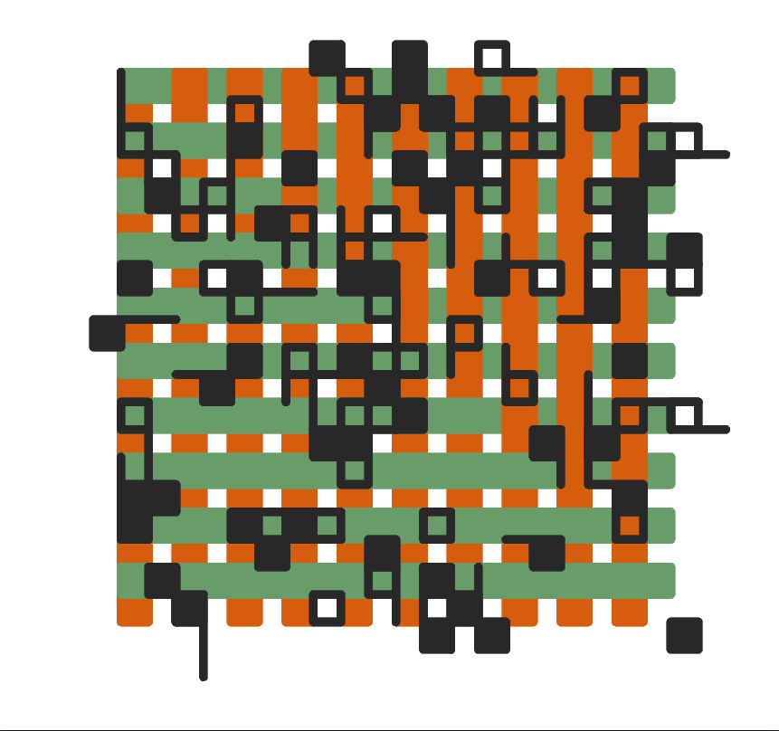
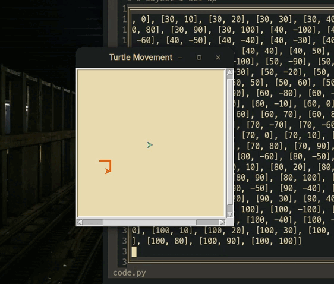
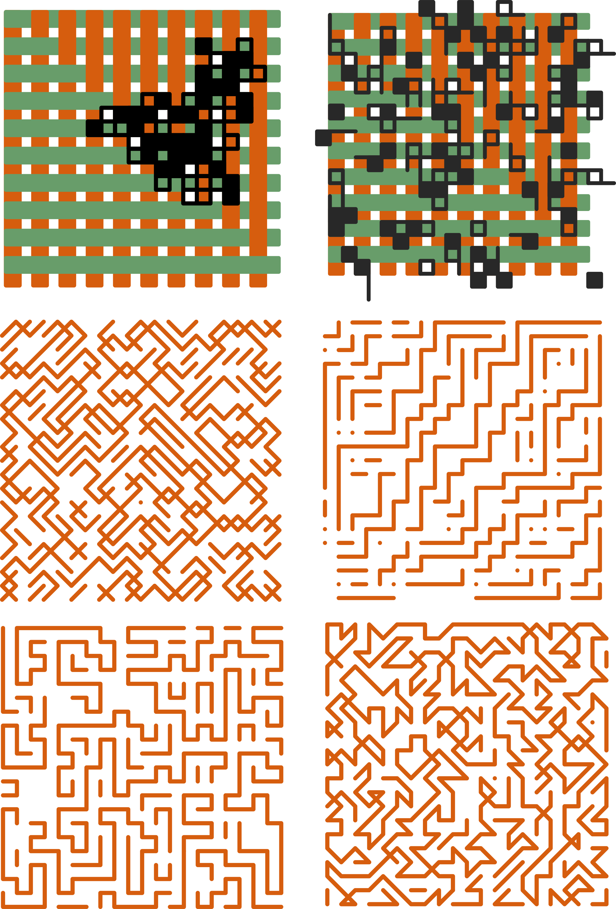

Lately, I've been casually playing Minesweeper, crosswords, and Sudoku to avoid spending too much time on social media, which often leaves us with little to show for our day. During one of these moments while playing Minesweeper, I noticed that the patterns formed during the game are quite interesting. So, I decided to design an algorithmic model that could create something similar but with my own twist.

## Plane Abstraction

A grid has $n \times n$ cells, from which we need to map all the points within the area, giving us a total of $n^2$ points. We then design the paths we want to generate in our model.

### 1. 3x3 Model

This model is inspired by Conway's well-known _Game of Life_, where a cell interacts with its neighboring cells, sensing the external environment to check which neighbors are alive or dead. In our case, we sense the neighboring cells to randomly determine a new point to advance to while simultaneously eliminating the current point.

This way, we obtain a trace map over which our cells advance.

Check the full project [here](https://drive.google.com/drive/folders/16pLMSz0uKvdQawVmk2J9s9fLw40J0POX?usp=sharing).

### Expanding the Mathematical Model

To better understand and expand this model, let's delve into the mathematics:

1. **Grid Representation**:

   - We represent the grid as a matrix of size $n \times n$. Each cell in the matrix can be considered as a point $(i, j)$ where $i$ and $j$ are the row and column indices respectively.

2. **Random Walk Algorithm**:

   - Starting from an initial cell, the algorithm randomly selects one of the neighboring cells to move to. This can be formulated as a random walk on a graph where each cell is a node and edges exist between adjacent cells.

3. **Probability and Random Selection**:

   - At each step, the probability of moving to a neighboring cell can be uniform (equal chance for all neighbors) or weighted based on certain criteria (e.g., distance, cell value).

4. **Path Elimination**:

   - Once a cell is visited, it can be marked or removed from the set of available cells to ensure that the algorithm doesn't revisit the same cell, simulating the process of "elimination" in Minesweeper.

5. **Pattern Formation**:
   - By iterating this process, complex patterns and paths emerge, which can be visualized using tools like Turtle graphics in Python.

This mathematical approach allows for the creation of intricate designs and patterns, providing a blend of art and algorithmic precision.

For more detailed exploration and implementation, refer to the full project linked above.

Enjoy the journey of blending art with algorithms!
