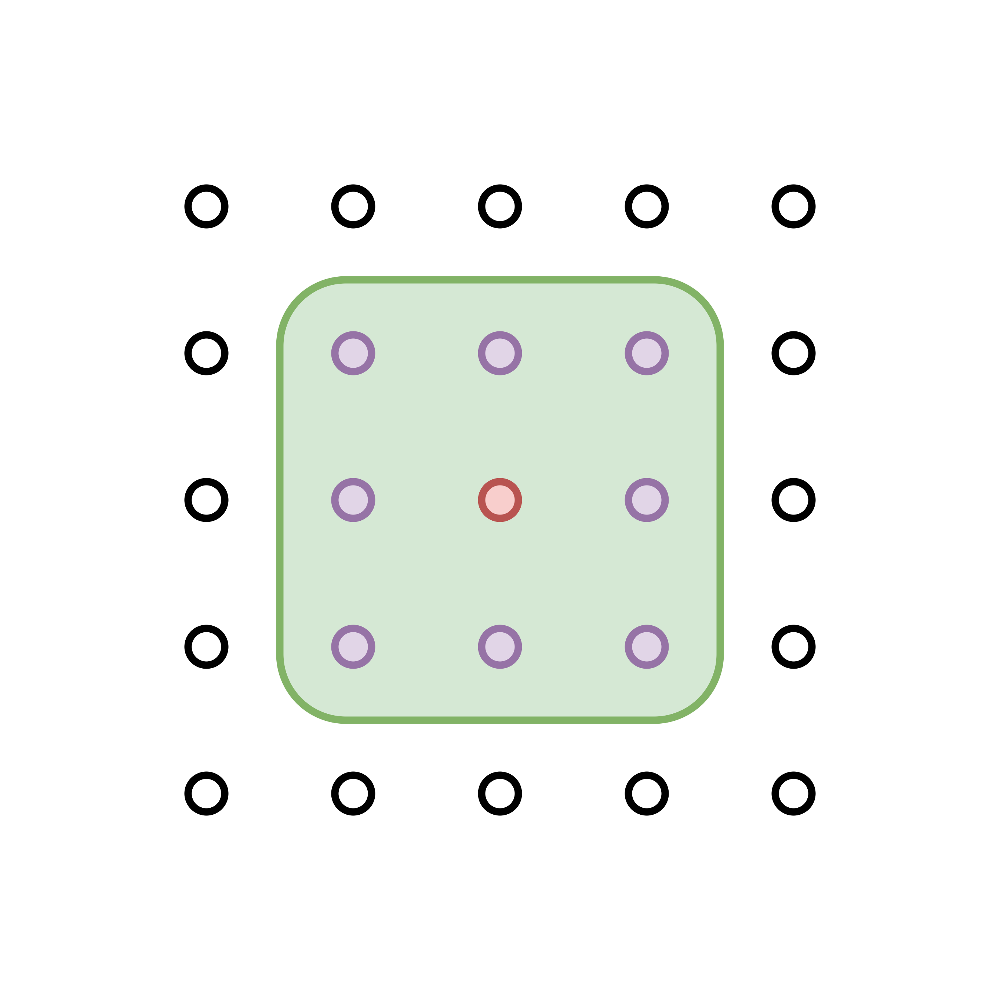
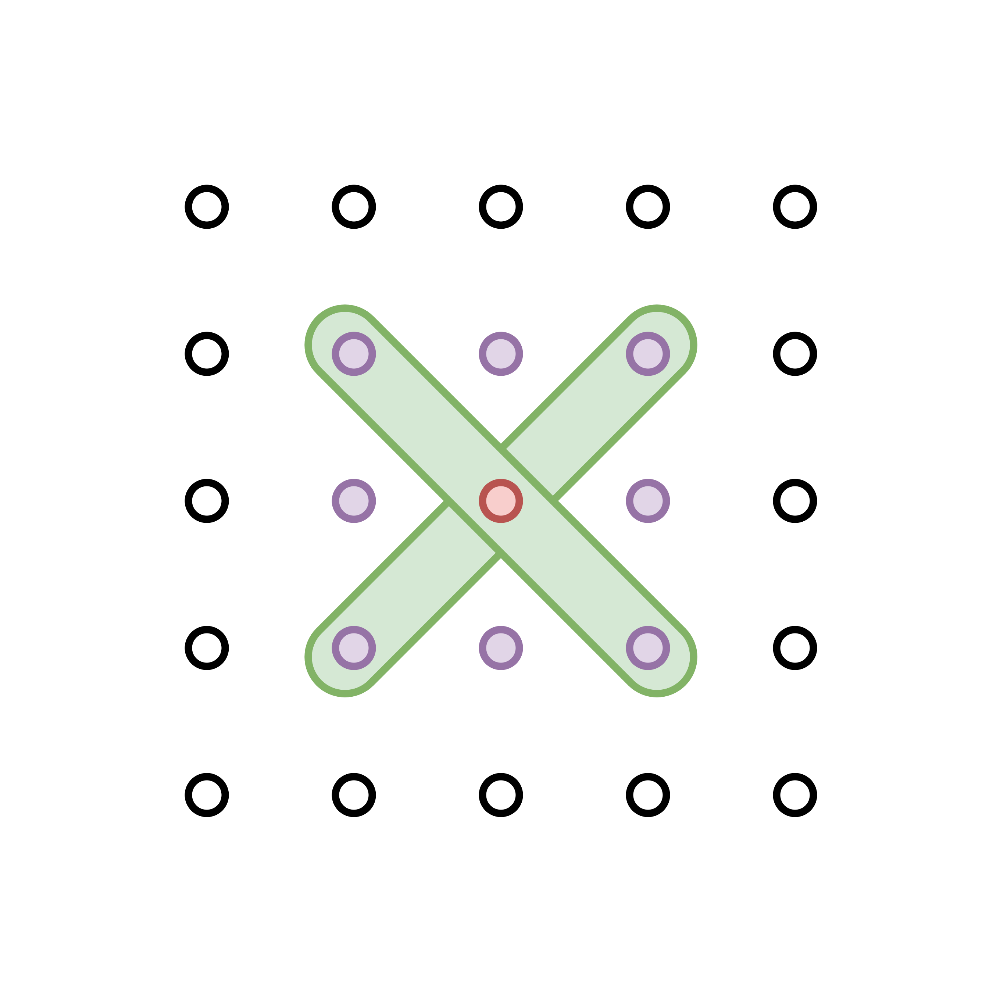
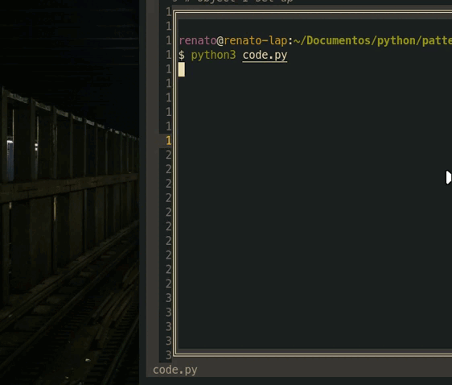

Hace no poco he empezado a jugar buscaminas, crusigramas y sodokus de forma casual, para evitar caer en las redes sociales que menos que poco nos dejan en el dia a dia. 
En uno de esos momentos mientras jugaba buscaminas me percate que las formas que se obtienen durante el juego son en realizadad interesantes, asi que me propuse a diseñar un modelo de algoritmo que diseñara algo parecido a esto pero con un poco de mi propia cosecha. 

## Abstraccion del plano
Una cuadricula tiene $n*n$ celdas de las cuales necesitamos mapear todos los puntos dentro de la zona, lo que nos da un total de $n^2$ de puntos. Luego diseñamos los caminos que queremos generar en nuestro modelo.

### 1. Modelo 3x3
Este modelo se piensa a partir del ya bien conocido *Juego de la Vida de Conway*, en el cual tenemos una celula que interactua con sus celulas vecinas, para esto sensa el embiente externo y verifica cuales de ellas siguen vivas y cuales no. 

En nuestro caso, sensamos a las celulas vecinas para obtener aletoriamente un nuevo punto de avance pero al mismo tiempo realiza la eliminacion del punto en el que nos encontramos actualmente. 
De esta forma obtenemos un mapa de trazos sobre el que nuestras celulas avanzan.

Check the full project [here](https://drive.google.com/drive/folders/16pLMSz0uKvdQawVmk2J9s9fLw40J0POX?usp=sharing)
