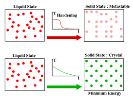
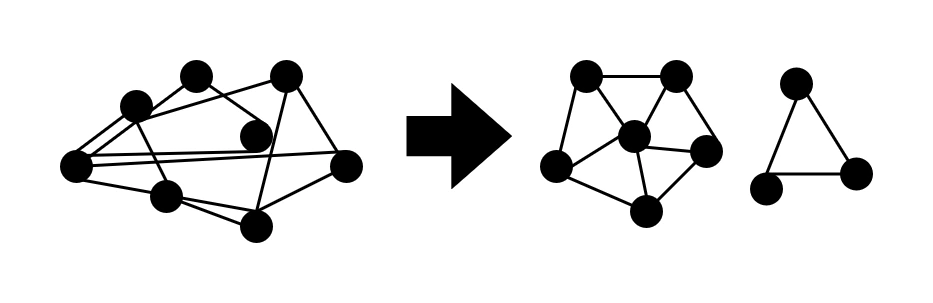

import Card from "/src/components/Card.astro";

In the last few days I have been trying to understand the Simulated Annealing algorithm, a randomized optimization algorithm inspired by the process of constantly heating and cooling a metal to make it stronger, so that the metal molecules regroup and the metal becomes stronger. However, my experience using the love2d video game engine made it possible for me to use it to represent such an algorithm, here is my way to achieve it.

## How does works Simulated Annealing?

Well, to explain it I need to refer to the article [[1]](#1) of 2018 where the authors expose and compare the operation of the same with respect to other similar algorithms, but in summary this method is based on a process defined as _hardening_, which consists of taking a solid or metal to very high temperatures until reaching the point of “melting”, and then cool it at a particular rate to reach a state of minimum energy.



And if we bring it to the computational environment, the algorithm that makes such a simulation would look like the following:

1. Initialization: $ i := istart, k := 0, c_k = c_0, L_k := L_0 $

2. Repeat:

   For $ l = 0 $ up to $ L_k $ do:

   Generate a solution $ j $ from the neighborhood $ S_i $ of the current solution $ i $.

   If $ f(j) < f(i) $ then:

   $ i := j $ ($j$ becomes the current solution).

   Otherwise, $ j $ becomes the current solution with probability `e^(f(i) - f(j))/(c_k)`

3. $ k := k + 1 $

4. Calculate($ L_k, c_k $)

5. Until $ c_k' \approx 0 $

In the sequel, let $c_k$ be the value of the temperature parameter, and $L_k$ be the number of transitions generated at some iteration $k$.

## Simulation design

Based on a similar project called [Simulated Annealing for Beautiful Graphs](https://a.tulv.in/simulated-annealing-for-beautiful-graphs.html) by Atul Vinayak, I took as a reference certain parts of his implementation and transported them to Lua/Love2d. In the first instance, this experiment aims to create graphs with defined characteristics such as distance between nodes, distance of edges, angles between edges and distribution of nodes over a given area.



### 1. Environment Setup

Like I've comment in past blogs, one of my hobbies is build games in Love2D, one of my favorite frameworks to dev games because use Lua, an amazing programming language (and fast!). So I recycled past game project base and implemented the following idea: A 2d space where I'll drop a set of orbs (points) connected between them in a specific way (manually declared or randomly generated) to iterate $k$ times (like ephocs or generations) the simulated annealing algorithm over this set of individuals, process that will result in a pretty/self-organized graph (one or more graphs), btw all the project uses OOP.

And to start with the experiment, I noticed that was somewhat repetitive and ineficient load one by one each of the orbs and relations manually in code, so I decided to create a simple syntax that would allow me write and modify much faster tests in `.txt` files and parse them with a function. Here an example of my syntax:

```txt
node 1 : x:128 , y:128
node 2 : x:100 , y:198
node 3 : x:128 , y:208
node 4 : x:128 , y:128
node 5 : x:128 , y:30
node 6 : x:128 , y:18
node 7 : x:100 , y:100

---

1 rel 2
2 rel 3
3 rel 4
4 rel 5
5 rel 6
6 rel 1

7 rel 1
7 rel 2
7 rel 3
7 rel 4
7 rel 5
7 rel 6

```

As you may have already noticed, the file is contains two parts: the node section is the first and here is where you will define every node with a number and (x,y) coordenates, it's important to respect the order of the nodes because this order will be necesary to load the second part of the file, the relation section, here you'll define every relation between the nodes defined in the first part of the file.

> If self-referenced relationships are defined, they won't be created to save processing time and resources.

So my parse function is the following:

```lua
...
self.nodes = self:ChargeNodes("./nodes3.txt")
...

function Room:ChargeNodes(file)
  local f = io.open(file, "rb")
  if f then
    f:close()
  end
  local lines = {}
  for line in io.lines(file) do
    lines[#lines + 1] = line
  end

  local nodes = {}

  for k, v in ipairs(lines) do
    if string.find(v, "node") then
      print(v)
      local nums = {}
      for num in string.gmatch(v, "%d+") do
        table.insert(nums, tonumber(num))
        print(num)
      end
      table.insert(nodes, self.area:addGameObject("Point", nums[2], nums[3], { number = nums[1] }))
    elseif string.find(v, "rel") then
      print(v)
      local nums = {}
      for num in string.gmatch(v, "%d+") do
        table.insert(nums, tonumber(num))
        print(num)
      end
      if nums[1] ~= nums[2] then
        table.insert(nodes[nums[1]].relations, nodes[nums[2]])
        print(#nodes[nums[1]].relations)
      end
    end
  end

  for k, v in ipairs(nodes) do
    print(k, v.number)
  end

  return nodes
end
```

## Simulation Architecture

My Love2D implementation is builded by the following architecture:

```txt
anchor/*.lua
objects/
  Point.lua
  Simulator.lua
test/
  nodes.txt
  nodes2.txt
  nodes3.txt
views/
  Sandbox.lua
globals.lua
main.lua
InterVariable.ttf
```

Now some clarifications:

- Simulator.lua is an object that starts and repeats the annealing simulation until the maximum number of iterations is reached. This object calculates the position of the nodes in the new state and performs these changes by applying forces to the Point.lua objects, which are in a real-time physics simulation.

- I've mastered Sandbox.lua as a **Room**. These objects instantiate a location in the game and enter a hibernation/pause state when the player moves to other **Rooms**. This improves game performance by saving these locations in memory, preventing them from being loaded every time the player enters the room more than twice.

- globals.lua contains a bunch of useful functions to load all .lua files from a dir, serialize lua tables into lua code (useful when you need to create an in-game level generator to build levels much faster), generator of UUID's and more.

- InterVariable.ttf is an open-source font that I love and try to use in all my projects. Please [check out](https://rsms.me/inter/) all the glyphs supported by this amazing font family.

> The anchor/ dir is a modified version of anchor lib from one of the projects of [a327ex](https://github.com/a327ex), the modified in question includes shader support for basic Love2D drawing (lines, circles, rectangles, etc) and not just images, **Room** support, updated collision system that works on Love2D 11.5

## The Energy Function

I feel it important to explain this function and how it works, as it was one of the most difficult aspects to develop in the project. In short, the energy function takes a state (in this case, a graph and the coordinates of each point), performs calculations to evaluate the distance between this state and the ideal (for us obtain a symmetric graph). These calculations have a parameter for each aspect we want to evaluate (one for the distribution of nodes in the area, another for the distances between nodes, another to evaluate the angles in the graph, etc.) to calibrate the algorithm more accurately. Finally, the function returns a numerical value (the new energy), and, as we saw in the [How does simulated annealing work?](#how-does-works-simulated-annealing) section, the algorithm compares the previous energy with the new energy and retains the best.

The math inside this function returns a minor energy if the state is close of the ideal state, but if the state is so far from the ideal state (collision between node's connections or irregular node distribution) the function will return a higher value in response of a wrong state. This let the algorithm to take the better states that are generated, but there is always a probability of taking an incorrect state to cover a larger area of states.

## Tests

<iframe
  src="https://drive.google.com/file/d/1wY7Ba9MW-tFyKQskPSeHbfkf1UgBXy2c/preview"
  allow="autoplay"
  width="100%"
  height="350px"
></iframe>

As can be seen in this first test (only one graph), the algorithm manages to 'unwrap' the connections of the graph in such a way that there are no collisions between the edges of the connections between the nodes, and then search for a better distribution of the nodes and the distances between them.

<iframe
  src="https://drive.google.com/file/d/1cH-tjXVSaW1A9XTP2iBsRvx88GSEAfEd/preview"
  allow="autoplay"
  width="100%"
  height="350px"
></iframe>

Finally, I challenge the algorithm to perform these processes with 2 different graphs in order to verify if there is not some kind of overlap between both graphs, and as can be seen it does it in a quite acceptable way.

## Final Thougths

Topics such as the one developed in this reading encourage me to continue research on numerical processes or optimization algorithms, because although AI can solve these problems easily, embedded systems or low performance hardware cannot handle an LLM for such complex and resource-limited actions. And seen from another point of view, if we improve basic processes through more efficient algorithms, processes such as LLM training will tend to become even more efficient.

Please I would appreciate if you go through my github repository and give it a star, as well as I invite you to try my project either to get closer to these interesting topics or just for fun. As always thanks for perusing this blog in a world where less and less people are willing to pay attention to scientific articles or complex topics.

## Source Code

<Card url="https://github.com/renatosanz/prettygraphs" />

## References

<a id="1">[1]</a>
Daniel Delahaye, Supatcha Chaimatanan, Marcel Mongeau.
https://enac.hal.science/hal-01887543/document Simulated annealing: From basics
to applications. Gendreau, Michel; Potvin, Jean-Yves. Handbook of
Metaheuristics, 272, Springer, pp.1-35.ISBN 978-3-319-91085-7, 2019,
International Series in Operations Research & Management Science (ISOR),
978-3-319-91086-4. 10.1007/978-3-319-91086-4_1 . hal-01887543
