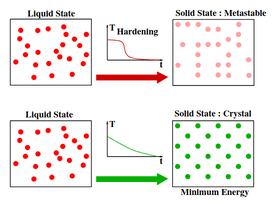

In the last few days I have been trying to understand the Simulated Annealing algorithm, a randomized optimization algorithm inspired by the process of constantly heating and cooling a metal to make it stronger, so that the metal molecules regroup and the metal becomes stronger. However, my experience using the love2d video game engine made it possible for me to use it to represent such an algorithm, here is my way to achieve it.

## How works Simulated Annealing?

Well, to explain it I need to refer to the article [[1]](#1). of 2018 where the authors expose and compare the operation of the same with respect to other similar algorithms, but in summary this method is based on a process defined as *hardening*, which consists of taking a solid or metal to very high temperatures until reaching the point of “melting”, and then cool it at a particular rate to reach a state of minimum energy.

Y si lo traemos al ambiente computacional, el algoritmo que hace dicha simulacion se veria como lo siguiente: 

1. Initialization: $ i := istart, k := 0, c_k = c_0, L_k := L_0 $

2. Repeat:

    For $ l = 0 $ up to $ L_k $ do:

    Generate a solution $ j $ from the neighborhood $ S_i $ of the current solution $ i $.

    If $ f(j) < f(i) $ then:

    $ i := j $ (j becomes the current solution).

    Otherwise, $ j $ becomes the current solution with probability $ e^{\frac{f(i) - f(j)}{c_k}} $

3. $ k := k + 1 $

4. Calculate($ L_k, c_k $)

5. Until $ c_k' \approx 0 $

In the sequel, let $c_k$ be the value of the temperature parameter, and $L_k$ be the number of transitions generated at some iteration $k$.

## Simulation design

Based on a similar project called [Simulated Annealing for Beautiful Graphs](https://a.tulv.in/simulated-annealing-for-beautiful-graphs.html) by Atul Vinayak, I took as a reference certain parts of his implementation and transported them to Lua/Love2d. In the first instance, this experiment aims to create graphs with defined characteristics such as distance between nodes, distance of edges, angles between edges and distribution of nodes over a given area.

## References
<a id="1">[1]</a> 
Daniel Delahaye, Supatcha Chaimatanan, Marcel Mongeau. 
https://enac.hal.science/hal-01887543/document
Simulated annealing: From basics to applications. 
Gendreau, Michel; Potvin, Jean-Yves. Handbook of Metaheuristics, 272, Springer, pp.1-35.ISBN 978-3-319-91085-7, 2019, International Series in Operations Research & Management Science
(ISOR), 978-3-319-91086-4.  10.1007/978-3-319-91086-4_1 .  hal-01887543
